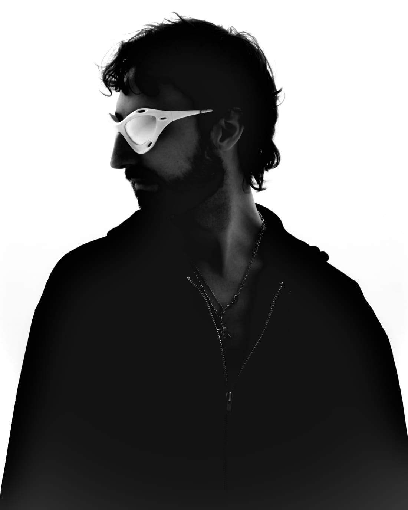
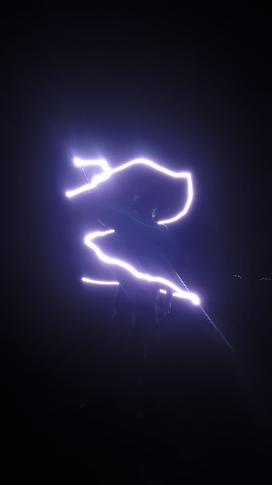
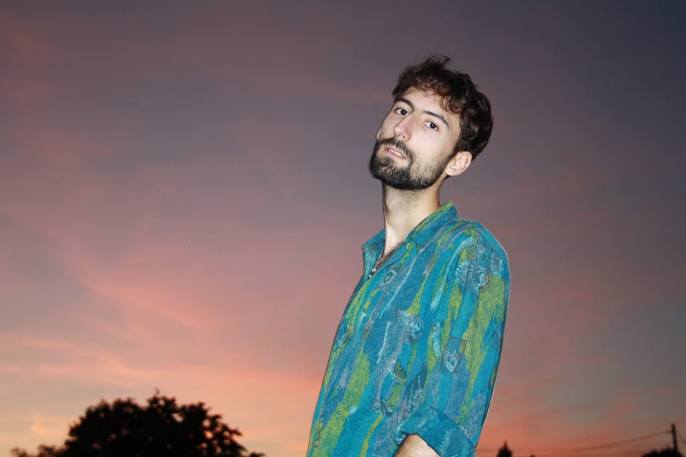

---
---

Valence is electronic music project of Miguel Clemente. Focused on bringing together cinematic sound design and atmospheric soundscapes, his music bridges the gap between experimental production and classical melodic craft.

His work began gaining notoriety in the 2010s EDM scene through label releases on Dreamscape and NoCopyrightSounds (NCS), most notably ‘Infinite’ with over 20 million streams across multiple platforms. Later milestones include his 2017 Remix of Halsey’s ‘Gasoline’ & the 2023 collaboration with Sri-Lankan artist KASHEEEY ‘Soulmate / Your Name.’

2025 was the first year of Live Touring for Valence. He played several festivals in Germany, including MODULAR Festival & Sommernaechte Augsburg. Recently relocating to Berlin, his music continues to develop around his fascination for the sounds of Future Bass, Art Pop & UK Garage.

-V-

